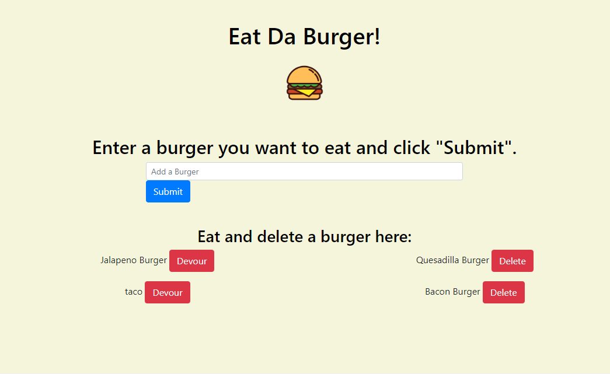

# burger

## Table of Contents  
[About](#About)   
[Deployment](#Deployment) 
[Preview](#Preview) 
[Installation](#Installation)     
[Questions](#questions)    

## About
This application allows users to:  
Enter a burger and sumbit it into the burger database.  
And 'devour' uneaten burgers, changing their devoured property in the database.
And 'delete' devoured burgers, removing them from the database.  

## Deployment
This app was deployed using Heroku and JAWSDB as a remote sql database. Follow the link to visit the site:  
[deployment-link](https://obscure-meadow-27942.herokuapp.com/)  

## Preview  

## Installation
For local installation:  
Clone the repository and run npm install to install dependencies. Using the schema and seeds in the db folder, create and populate a burgers_db database.
Run node server.js from the project root to start the server on localhost:8080. Go to localhost:8080 to view the application.

## Questions  

[My Github](https://github.com/apemint)